# Sistema de Recomendación de Productos - Tienda en Línea

## Descripción del Proyecto

Este proyecto implementa un sistema de recomendación de productos para una tienda en línea, desarrollado con C++ y Qt. Permite a los usuarios registrarse, iniciar sesión, explorar productos por categoría, recibir recomendaciones personalizadas basadas en su historial y preferencias, y buscar productos utilizando diversos filtros (categoría, marca, rango de precios).

## Diagrama de flujo principal del programa

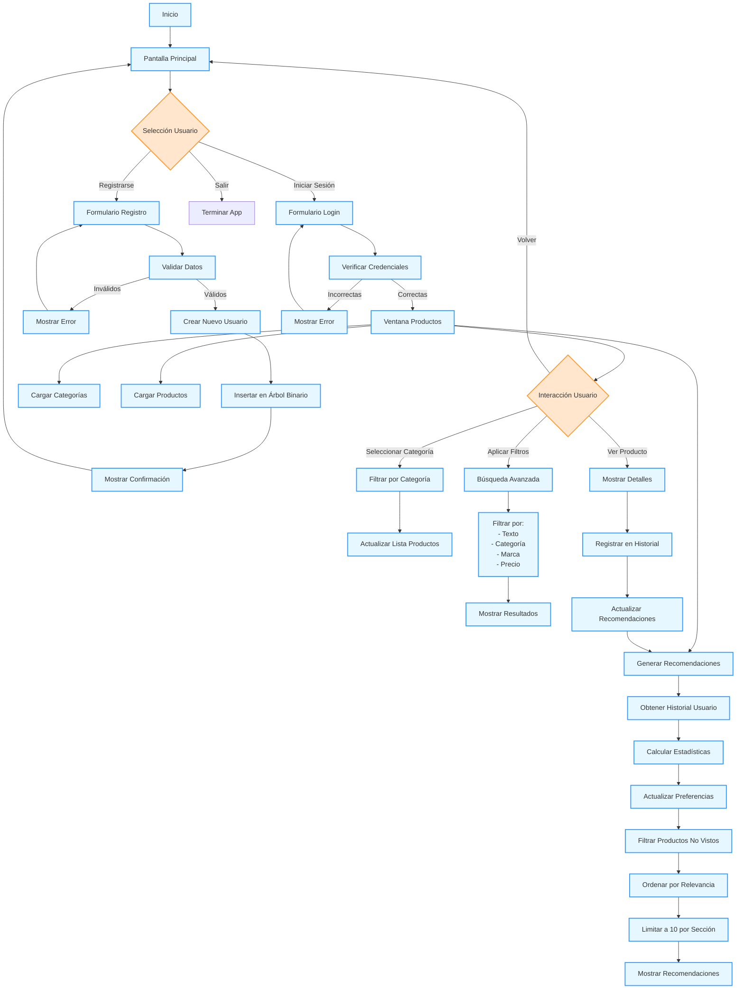

## Descripcion por secciones

### Seccion inicial

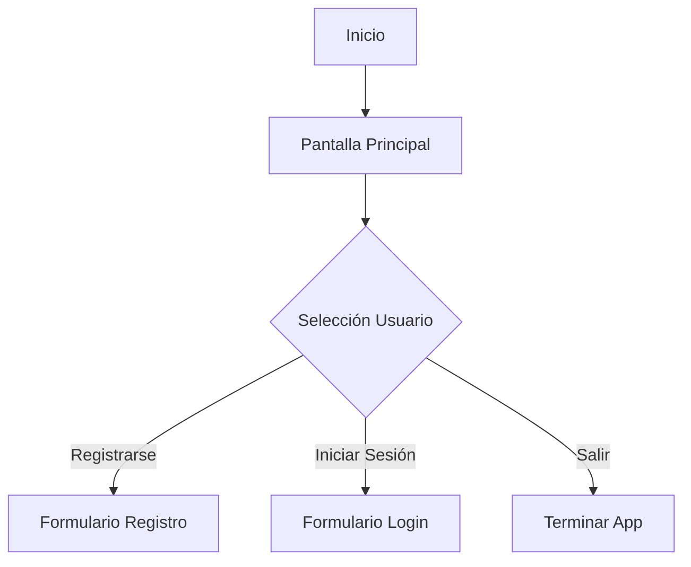

- *Pantalla Principal*: Menú con 3 opciones.
- *Decisión*: Usuario selecciona una acción.

---

### Seccion de registro

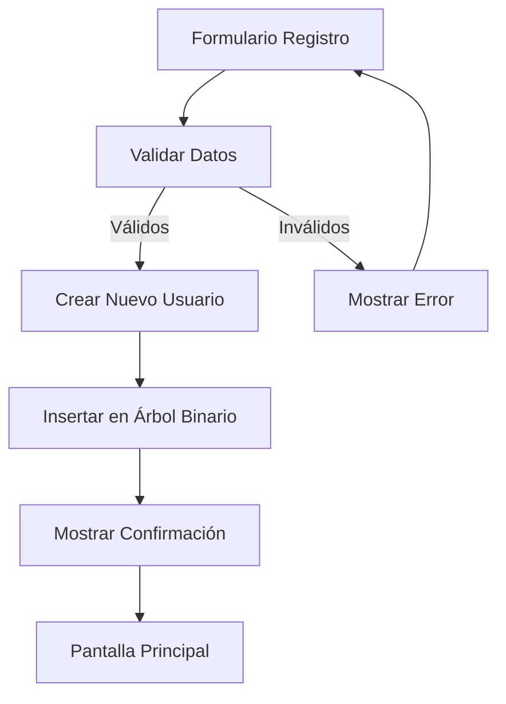

- *Validación*: Nombre, usuario único, contraseña segura
- *Creación*: Genera ID único y almacena en árbol binario
- *Retroalimentación*: Confirmación o mensajes de error

---

### Seccion de login

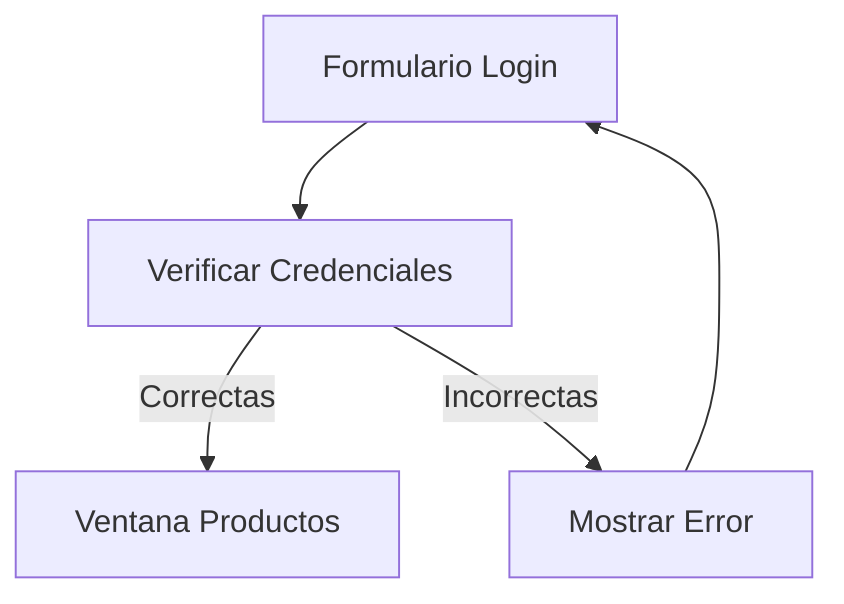

- *Verificación*: Compara con datos en árbol binario
- *Acceso*: Solo con credenciales válidas
- *Error*: Mensaje específico para usuario/contraseña incorrectos

---

### Seccion de productos (Vista previa)

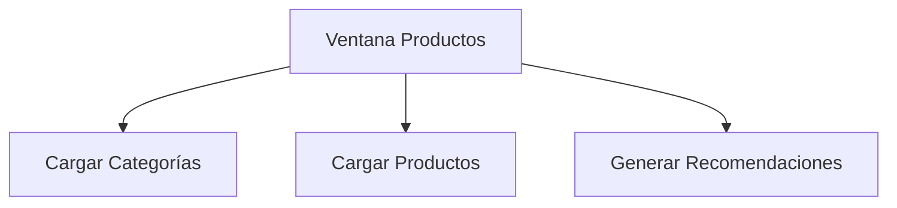

- *Carga inicial*: Organiza productos por categoría
- *Recomendaciones*: Personalizadas basadas en preferencias

---

### Seccion sistema de recomendacion (basica, mas adelante se explica mas detalladamente)

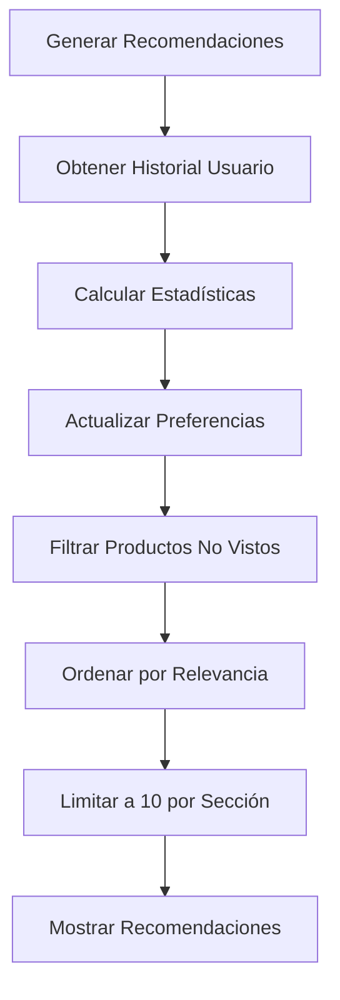

- *Personalización*: Basada en historial de visualizaciones
- *Filtrado*: Excluye productos ya vistos
- *Limitación*: Máximo 10 productos por sección

---

### Interaccion del usuario

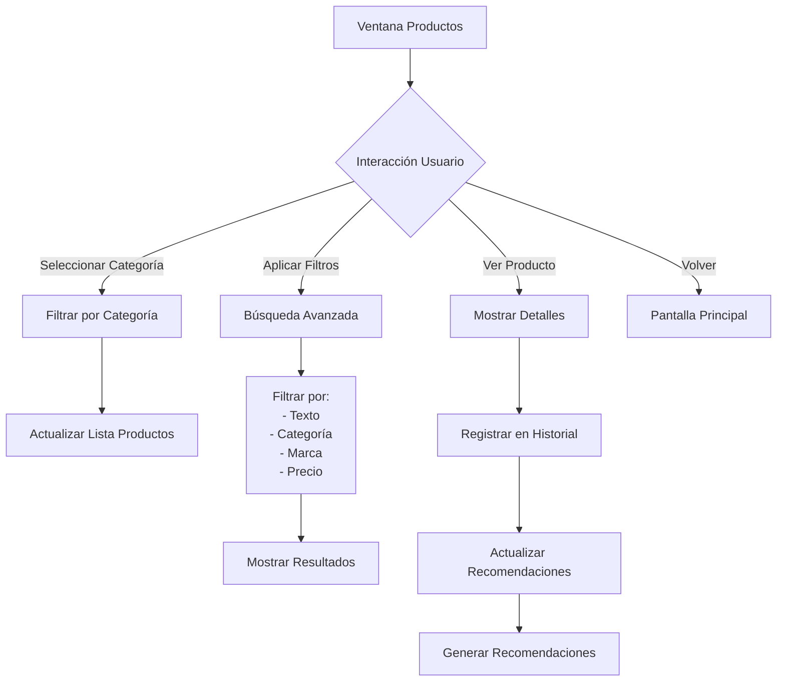

- *Navegación*: Entre categorías y productos
- *Búsqueda*: Combinación múltiple de filtros
- *Historial*: Registro automático al ver detalles
- *Actualización*: Recomendaciones en tiempo real

---

## Diagrama de Flujo Detallado del Sistema de Recomendaciones

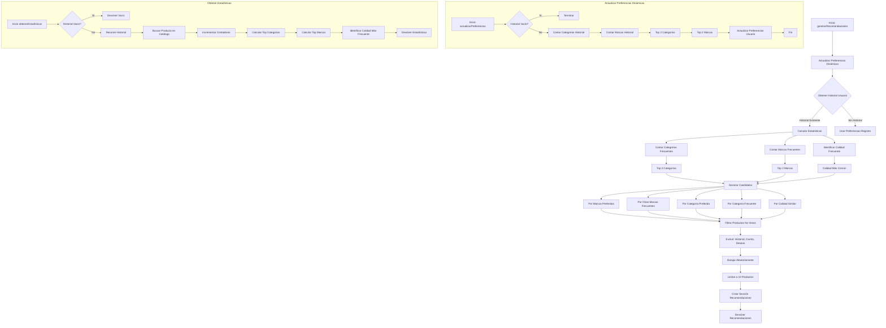

## Explicacion detallada del proceso

### Actualización de Preferencias Dinámicas

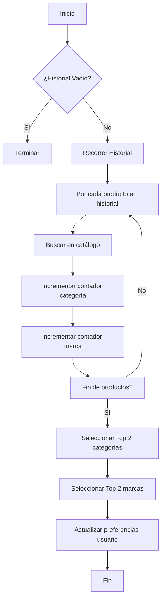

- *Análisis de Historial*: Examina todos los productos vistos por el usuario
- *Conteo de Preferencias*: Registra frecuencia de categorías y marcas
- *Actualización*: Reemplaza preferencias iniciales con las nuevas detectadas

---

### Cálculo de Estadísticas de Usuario

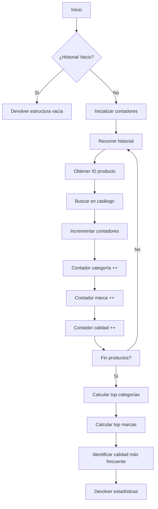

- *Recolección de Datos*: Para cada producto en historial
- *Categorización*: Clasifica por categoría, marca y calidad
- *Cálculo de Tops*: Identifica los 2 elementos más frecuentes en cada categoría

---

### Generación de Candidatos

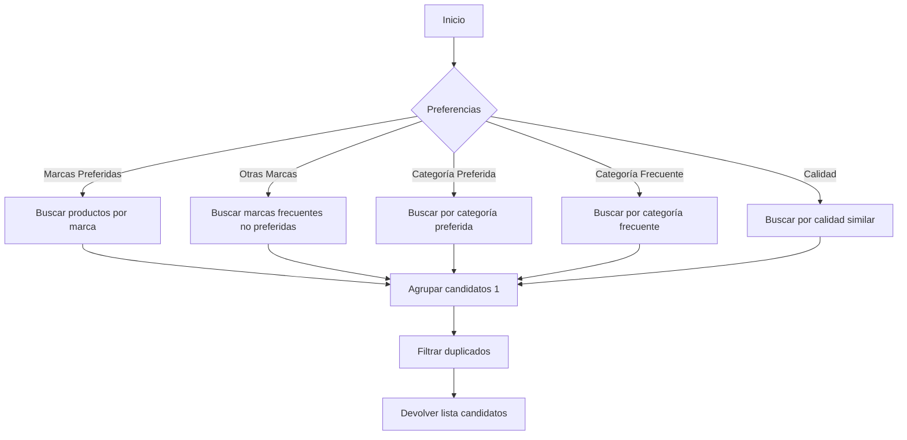

- *Búsqueda Multicriterio*: 5 fuentes diferentes de recomendaciones
- *Agrupamiento*: Combina resultados de todas las fuentes
- *Deduplicación*: Elimina productos repetidos entre categorías

---

### Filtrado y Limpieza

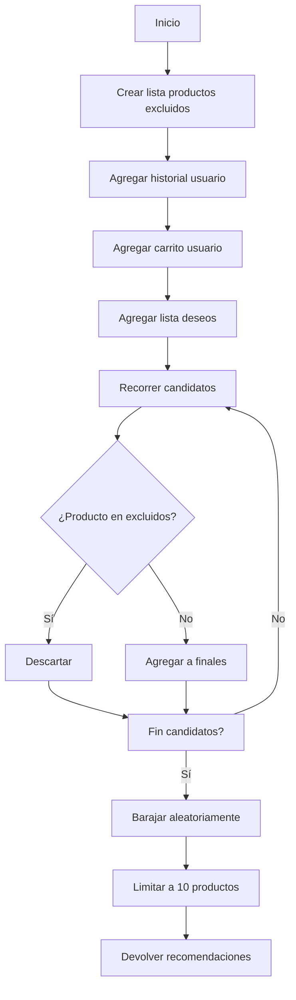

- *Exclusión*: Elimina productos ya conocidos por el usuario
- *Aleatorización*: Mezcla productos para mayor variedad
- *Limitación*: Selecciona máximo 10 productos por sección

---

### Reglas Clave del Sistema

1. **Jerarquía de Recomendaciones**

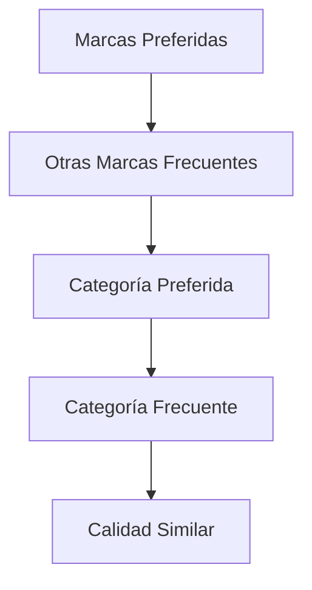

2. **Lógica de Filtrado**
    - Los productos vistos (historial) tienen máxima prioridad de exclusión.
    - Los productos en carrito o en la lista de deseos se excluyen automáticamente.
    - Si no hay historial, se utilizan las preferencias registradas por el usuario.

3. **Mecanismo de Actualización**
    - El sistema de recomendaciones se regenera completamente al:
      - Iniciar sesión
      - Ver detalles de un producto
      - Cambiar de categoría
    - Actualización en tiempo real: entre 100 y 500 ms según el tamaño del historial.

4. **Algoritmos Clave**
    - Map-Reduce para el conteo de frecuencias.
    - Barajado Fisher-Yates para la aleatorización.
    - Búsqueda binaria para filtrado eficiente.
    - Árboles binarios para la gestión de exclusiones.

## Modulos del programa

### 1. mainwindow (Ventana Principal)
**Descripción:** Ventana inicial de la aplicación con opciones para registrarse, iniciar sesión o salir.

**Funciones:**
- `on_Regis_clicked()`: Abre ventana de registro
- `on_salir_clicked()`: Cierra la aplicación
- `on_Inicio_clicked()`: Muestra formulario de inicio de sesión
- `on_volver_clicked()`: Vuelve a pantalla inicial
- `on_ingresar_clicked()`: Verifica credenciales y abre ventana de productos

---

### 2. registro_usuario (Registro de Usuario)
**Descripción:** Ventana para registrar nuevos usuarios con sus preferencias.

**Funciones:**
- `on_buttonBox_accepted()`: Valida y registra usuario
- `on_buttonBox_rejected()`: Cancela registro

---

### 3. ventana_productos (Ventana de Productos)
**Descripción:** Interfaz principal después del login con productos y recomendaciones.

**Funciones:**
- `llenarFiltros()`: Carga categorías/marcas/precios
- `cargarProductosPorCategoria()`: Muestra productos por categoría
- `cargarRecomendaciones()`: Genera recomendaciones personalizadas
- `mostrarDetallesProducto()`: Muestra detalles del producto
- `on_pushButton_clicked()`: Realiza búsqueda con filtros

---

### 4. productodialog (Diálogo de Producto)
**Descripción:** Muestra detalles completos de un producto.

**Funciones:**
- `on_pushButton_clicked()`: Cierra el diálogo

---

### 5. catalogo (Catálogo de Productos)
**Descripción:** Gestiona el catálogo global de productos.

**Funciones:**
- `inicializarCatalogo()`: Carga productos iniciales
- Funciones de búsqueda (`buscarPorCategoria`, `buscarPorMarca`, etc.)

---

### 6. usuario (Gestión de Usuarios)
**Descripción:** Maneja operaciones con usuarios (inserción, búsqueda).

**Funciones:**
- `crearNodo()`, `insertar()`, `buscar()`, `verificarPassword()`

---

### 7. utilidades (Funciones Auxiliares)
**Descripción:** Proporciona funciones de utilidad general.

**Funciones:**
- `generarID()`, `aMinusculas()`, manipulación de listas, sets y mapas

---

### 8. recomendacion (Sistema de Recomendación)
**Descripción:** Genera recomendaciones personalizadas basadas en historial.

**Funciones:**
- `generarRecomendaciones()`, `obtenerEstadisticasUsuario()`, `actualizarPreferenciasDinamicas()`

## Estructuras de Datos y sus Atributos
Definidas en estructuras.h
### Producto
Representa un artículo en el catálogo.

- **descripcion**: `std::string` — Nombre del producto.
- **id**: `int` — Identificador único.
- **marca**: `std::string` — Fabricante del producto.
- **precio**: `double` — Valor en dólares.
- **calidad**: `int` — Valoración (1-5 estrellas).
- **categoria**: `std::string` — Grupo de clasificación.

---

### NodoProducto
Nodo para lista enlazada de productos.

- **dato**: `Producto` — Producto almacenado.
- **siguiente**: `NodoProducto*` — Puntero al siguiente nodo.

---

### ListaProducto
Lista enlazada de productos.

- Tipo: `NodoProducto*`

---

### Nodolista
Nodo para listas enlazadas de cadenas de texto.

- **dato**: `std::string` — Valor almacenado.
- **siguiente**: `Nodolista*` — Puntero al siguiente nodo.

---

### ListaString
Lista enlazada de cadenas de texto.

- Tipo: `Nodolista*`

---

### Usuario
Datos de usuario registrado.

- **nombre**: `std::string`
- **apellido**: `std::string`
- **id**: `std::string` — Identificador único.
- **usuario**: `std::string` — Nombre de usuario.
- **password**: `std::string`
- **preferencias**: `ListaString` — Marcas favoritas.
- **categoriasPreferidas**: `ListaString`
- **historial**: `ListaString` — IDs de productos vistos.
- **carrito**: `ListaString` — IDs en carrito.
- **listaDeseos**: `ListaString` — IDs en lista de deseos.

---

### Nodoarbol
Nodo para árbol binario de usuarios.

- **dato**: `Usuario`
- **izquierda**: `Nodoarbol*`
- **derecha**: `Nodoarbol*`

---

### Recomendaciones
Resultados del sistema de recomendación.

- **porMarcasPreferidas**: `ListaProducto`
- **porOtrasMarcasFrecuentes**: `ListaProducto`
- **porCategoriaPreferida**: `ListaProducto`
- **porCategoriaFrecuente**: `ListaProducto`
- **porCalidad**: `ListaProducto`

---

### EstadisticasUsuario
Datos estadísticos de comportamiento.

- **categoriasFrecuentes**: `ListaString`
- **marcasFrecuentes**: `ListaString`
- **calidadFrecuente**: `int`

## Módulos y sus Funciones

### 1. mainwindow (Gestión de Ventana Principal)
- **on_Regis_clicked()**: Abre ventana de registro.
- **on_Inicio_clicked()**: Muestra formulario de login.
- **on_ingresar_clicked()**: Valida credenciales de usuario.
- **on_salir_clicked()**: Cierra la aplicación.
- **on_volver_clicked()**: Regresa a pantalla inicial.

---

### 2. registro_usuario (Registro de Nuevos Usuarios)
- **on_buttonBox_accepted()**: Valida y registra nuevo usuario.
- **on_buttonBox_rejected()**: Cancela registro.

---

### 3. ventana_productos (Interfaz Principal de Productos)
- **llenarFiltros()**: Carga categorías/marcas en comboboxes.
- **cargarProductosPorCategoria()**: Muestra productos por categoría.
- **cargarRecomendaciones()**: Genera y muestra recomendaciones.
- **mostrarDetallesProducto()**: Abre diálogo con detalles de producto.
- **on_pushButton_clicked()**: Ejecuta búsqueda con filtros.
- **on_Volver_clicked()**: Regresa a pantalla principal.

---

### 4. recomendacion (Sistema de Recomendaciones)
- **generarRecomendaciones()**: Coordina proceso completo.
- **obtenerEstadisticasUsuario()**: Calcula preferencias de usuario.
- **actualizarPreferenciasDinamicas()**: Ajusta preferencias basado en historial.
- **obtenerTopN()**: Selecciona N elementos más frecuentes.
- **ordenarPorRelevancia()**: Ordena productos por relevancia.

---

### 5. catalogo (Gestión de Productos)
- **inicializarCatalogo()**: Carga datos iniciales de productos.
- **buscarPorCategoria()**: Filtra productos por categoría.
- **buscarPorRangoPrecios()**: Filtra por rango de precios.
- **buscarPorMarca()**: Filtra por marca.
- **buscarPorDescripcion()**: Búsqueda textual en descripciones.
- **obtenerCategoriasUnicas()**: Lista categorías disponibles.
- **obtenerMarcasUnicas()**: Lista marcas disponibles.

---

### 6. usuario (Gestión de Usuarios)
- **crearNodo()**: Inicializa nodo de árbol.
- **insertar()**: Inserta usuario en árbol binario.
- **buscar()**: Busca usuario en árbol.
- **verificarPassword()**: Compara contraseñas.

---

### 7. utilidades (Funciones Auxiliares)
- **generarID()**: Crea identificador único.
- **aMinusculas()**: Normaliza texto a minúsculas.
- **insertarLista()**: Agrega elemento a lista enlazada.
- **existeEnLista()**: Verifica existencia en lista.
- **insertarEnLista()**: Agrega producto a lista.
- **longitudLista()**: Calcula tamaño de lista.
- **barajarLista()**: Aleatoriza orden de lista.
- **buscarEnSet()**: Verifica existencia en conjunto.
- **insertarEnSet()**: Agrega elemento a conjunto.
- **incrementarEnMapa()**: Aumenta contador en mapa.
- **mapaEstaVacio()**: Verifica si mapa está vacío.

---

### 8. productodialog (Diálogo de Detalles de Producto)
- **on_pushButton_clicked()**: Cierra el diálogo.
